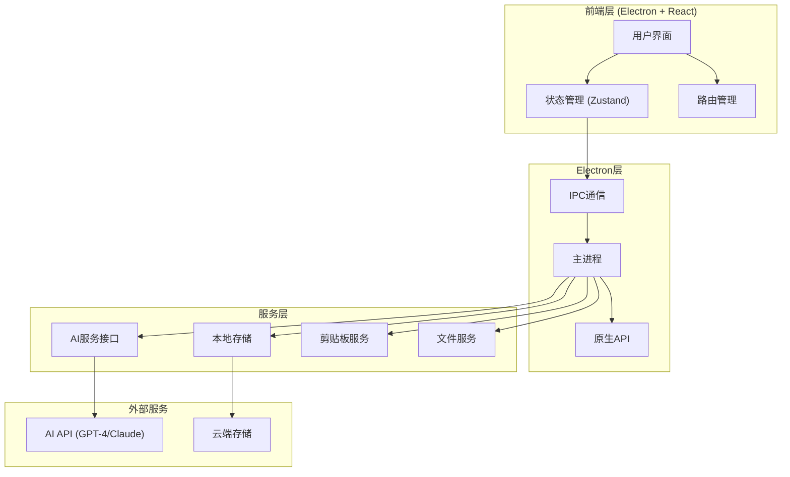
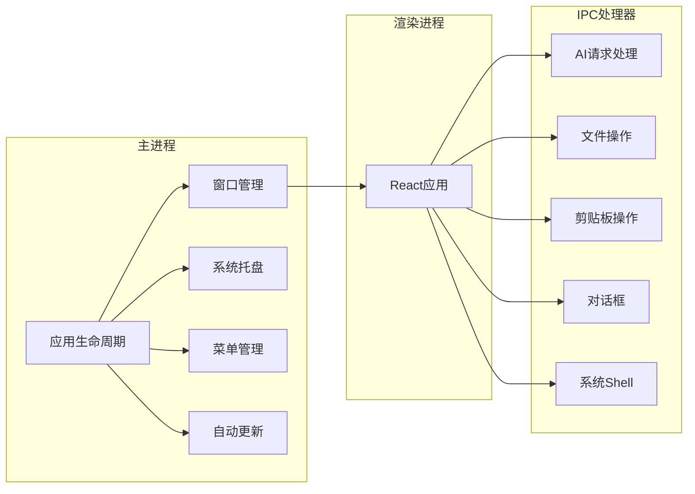

## 1. 架构设计



## 2. 技术说明

- **前端框架**: React 18 + TypeScript + Vite
- **桌面框架**: Electron 28
- **样式方案**: TailwindCSS 3 + CSS Variables
- **状态管理**: Zustand
- **路由管理**: React Router 6
- **图表库**: ECharts / Recharts
- **代码编辑器**: Monaco Editor
- **Markdown渲染**: react-markdown
- **图标库**: Lucide React
- **动画库**: Framer Motion
- **构建工具**: Vite + electron-builder

## 3. 路由定义

| 路由 | 用途 | 权限 |
|------|------|------|
| `/` | 首页，展示功能入口和统计 | 所有用户 |
| `/functions` | 智能函数页面 | 所有用户 |
| `/functions/:id` | 具体函数执行页面 | 所有用户 |
| `/formula` | 公式工具页面 | 所有用户 |
| `/formula/explain` | 公式释义 | 所有用户 |
| `/formula/fix` | 公式改错 | 所有用户 |
| `/formula/generate` | 智问公式 | 所有用户 |
| `/data` | 数据处理页面 | 所有用户 |
| `/data/analysis` | 数据分析 | 所有用户 |
| `/data/generate` | 数据生成 | 所有用户 |
| `/data/transform` | 智换数据 | 所有用户 |
| `/code` | 代码助手页面 | 所有用户 |
| `/code/generate` | 代码生成 | 所有用户 |
| `/code/library` | 代码库 | 所有用户 |
| `/creative` | 创意工具页面 | 所有用户 |
| `/creative/image` | 图片生成 | 登录用户 |
| `/creative/mindmap` | 思维导图 | 所有用户 |
| `/creative/translate` | 智能翻译 | 所有用户 |
| `/profile` | 个人中心 | 登录用户 |
| `/settings` | 系统设置 | 登录用户 |
| `/login` | 登录页面 | 未登录用户 |
| `/register` | 注册页面 | 未登录用户 |

## 4. API定义

### 4.1 AI服务接口

```typescript
// AI请求基础类型
interface AIRequest {
  prompt: string;
  model?: 'gpt-4' | 'gpt-4o' | 'gpt-3.5-turbo' | 'claude-3';
  temperature?: number;
  maxTokens?: number;
}

// AI响应类型
interface AIResponse {
  success: boolean;
  data?: string;
  error?: string;
  usage?: {
    promptTokens: number;
    completionTokens: number;
    totalTokens: number;
  };
}

// 公式释义请求
interface FormulaExplainRequest {
  formula: string;
  language?: 'zh' | 'en';
}

// 公式改错请求
interface FormulaFixRequest {
  formula: string;
  context?: string;
}

// 智问公式请求
interface FormulaGenerateRequest {
  description: string;
  dataRange?: string;
  outputType?: 'single' | 'array';
}

// 数据分析请求
interface DataAnalysisRequest {
  data: string[][];
  analysisType: 'summary' | 'trend' | 'comparison' | 'correlation';
  options?: {
    includeVisualization?: boolean;
    language?: 'zh' | 'en';
  };
}

// 代码生成请求
interface CodeGenerateRequest {
  description: string;
  language: 'vba' | 'python' | 'javascript';
  context?: string;
}

// 图片生成请求
interface ImageGenerateRequest {
  prompt: string;
  size?: '256x256' | '512x512' | '1024x1024';
  style?: 'natural' | 'vivid';
}

// 翻译请求
interface TranslateRequest {
  text: string;
  sourceLang: string;
  targetLang: string;
}
```

### 4.2 用户服务接口

```typescript
// 用户信息
interface User {
  id: string;
  email: string;
  phone?: string;
  name: string;
  avatar?: string;
  plan: 'free' | 'pro' | 'enterprise';
  credits: number;
  createdAt: Date;
}

// 登录请求
interface LoginRequest {
  email: string;
  password: string;
}

// 注册请求
interface RegisterRequest {
  email: string;
  password: string;
  name: string;
}

// 使用记录
interface UsageRecord {
  id: string;
  userId: string;
  feature: string;
  model: string;
  tokens: number;
  timestamp: Date;
}

// 用量统计
interface UsageStats {
  total: number;
  today: number;
  thisMonth: number;
  byFeature: Record<string, number>;
  byModel: Record<string, number>;
}
```

## 5. 本地存储设计

### 5.1 存储架构

使用 Electron 的 electron-store 进行本地数据持久化，结合 SQLite 进行结构化数据存储。

```typescript
// 存储键定义
interface StoreSchema {
  'user.preferences': {
    theme: 'light' | 'dark' | 'system';
    language: 'zh' | 'en';
    fontSize: number;
    autoSave: boolean;
  };
  'user.credentials': {
    accessToken: string;
    refreshToken: string;
    expiresAt: number;
  };
  'app.cache': {
    recentFiles: string[];
    recentFunctions: string[];
    codeLibrary: CodeSnippet[];
  };
  'app.settings': {
    defaultModel: string;
    apiKey?: string;
    apiEndpoint?: string;
  };
}

// 代码片段
interface CodeSnippet {
  id: string;
  title: string;
  language: 'vba' | 'python' | 'javascript';
  code: string;
  tags: string[];
  createdAt: Date;
  updatedAt: Date;
}
```

### 5.2 数据库表设计

```sql
-- 使用记录表
CREATE TABLE usage_records (
  id TEXT PRIMARY KEY,
  user_id TEXT NOT NULL,
  feature TEXT NOT NULL,
  model TEXT NOT NULL,
  input_tokens INTEGER DEFAULT 0,
  output_tokens INTEGER DEFAULT 0,
  created_at DATETIME DEFAULT CURRENT_TIMESTAMP
);

-- 代码库表
CREATE TABLE code_library (
  id TEXT PRIMARY KEY,
  title TEXT NOT NULL,
  language TEXT NOT NULL,
  code TEXT NOT NULL,
  tags TEXT,
  created_at DATETIME DEFAULT CURRENT_TIMESTAMP,
  updated_at DATETIME DEFAULT CURRENT_TIMESTAMP
);

-- 历史记录表
CREATE TABLE history (
  id TEXT PRIMARY KEY,
  type TEXT NOT NULL,
  input TEXT NOT NULL,
  output TEXT,
  model TEXT,
  created_at DATETIME DEFAULT CURRENT_TIMESTAMP
);

-- 索引
CREATE INDEX idx_usage_user ON usage_records(user_id);
CREATE INDEX idx_usage_date ON usage_records(created_at);
CREATE INDEX idx_history_type ON history(type);
CREATE INDEX idx_history_date ON history(created_at);
```

## 6. Electron主进程架构



## 7. 安全设计

### 7.1 API密钥管理

- 用户API密钥使用 electron-safe-storage 加密存储
- 不在代码中硬编码任何密钥
- 支持用户自定义API端点

### 7.2 数据安全

- 本地敏感数据加密存储
- 网络请求使用HTTPS
- 实现请求签名验证

### 7.3 进程安全

- 启用 contextIsolation
- 禁用 nodeIntegration
- 使用 preload 脚本暴露有限API

## 8. 打包发布

### 8.1 构建配置

```json
{
  "build": {
    "appId": "com.excelai.desktop",
    "productName": "Excel AI 助手",
    "directories": {
      "output": "release"
    },
    "files": [
      "dist/**/*",
      "node_modules/**/*",
      "package.json"
    ],
    "win": {
      "target": ["nsis", "portable"],
      "icon": "assets/icon.ico"
    },
    "mac": {
      "target": ["dmg", "zip"],
      "icon": "assets/icon.icns"
    },
    "linux": {
      "target": ["AppImage", "deb"],
      "icon": "assets/icon.png"
    },
    "nsis": {
      "oneClick": false,
      "allowToChangeInstallationDirectory": true,
      "createDesktopShortcut": true,
      "createStartMenuShortcut": true
    }
  }
}
```

### 8.2 自动更新

- 使用 electron-updater 实现自动更新
- 支持增量更新减少下载量
- 更新服务器部署在云端